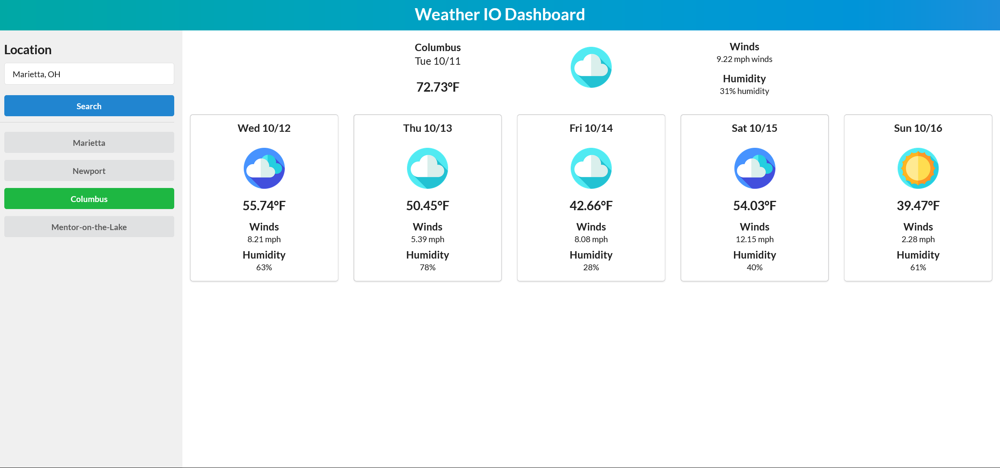

<h1 align='center'>

**Weather.io**

<!-- LICENSE BADGE -->

</h1>

Weather.io - where you can get the weather info you need, and none that you don't.

 
<h2 align='center'>

**Table of Contents**
</h2>

&nbsp;&nbsp;

 

### Demo
---
[Weather IO](https://devbritt.github.io/weather-io/)

 

### Lessons
---
Being that I returned to this assignment towards the end of the coding bootcamp, it was much easier than it would have been at the beginning. However, it helped me reinforce some of the basic concepts of web development that are easy to overlook when working on more complicated projects. It's been quite some time since I've worked with vanilla HTML and CSS and it's always good to go back to the basics every now and then.
